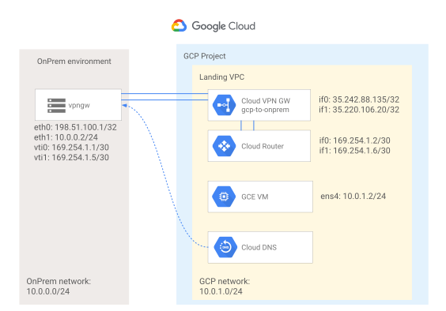

# Setting up a simulated on-prem environment for GCP

This guide walks you through how to configure
[strongSwan](https://www.strongswan.org/), [frr](https://frrouting.org/) and
[CoreDNS](https://coredns.io/) to simulate an on premises environment, to be integrated with a Google Cloud environment leveraging
[Google Cloud VPN HA](https://cloud.google.com/network-connectivity/docs/vpn) and [Google Cloud DNS](https://cloud.google.com/dns/docs/overview/). This
information is provided as an example only and is not meant to be a
comprehensive overview of IPsec, BGP and DNS. Basic knowledge of the involved
protocols is required.

## Topology

The topology outlined by this guide is a site-to-site IPsec VPN HA tunnel
configuration per the diagram below:



## GCP environment

This guide assumes you have an empty GCP project with billing enabled.

The following values are also assumed for your GCP environment:

|Name|Value|Description|
|-|-|-|
|Cloud VPN Gateway INTERFACE0 |`35.242.91.63`|IP for the VPN Gateway INTERFACE0, generated when creating the VPN Gateway|
|Cloud VPN Gateway INTERFACE1 |`35.220.112.158`|IP for the VPN Gateway INTERFACE1, generated when creating the VPN Gateway|
|Project id|`vpn-lab-foobar`|Project ID for the existing GCP project where the environment will be set up|
|Region|`europe-west1`|Deployment region for the GCP environment|
|VPC|`vpc`|Name for the GCP VPC|
|VPC CIDR|`10.0.1.0/24`|GCP network CIDR|

## On premises environment

Although the configurations and steps described in the following sections should apply to a wide range of Linux distributions, this guide assumes the following setup:

* Clean Debian 11 installation
* Two network interfaces (eth0 external, eth1 internal)
* Root access to the machine
* Your on-premises firewall allows
  * UDP 53
  * UDP 500
  * UDP 4500
  * ESP proto

The following values are also assumed for your on premises environment:

|Name|Value|Description|
|-|-|-|
|External IP|`78.46.123.183`|External IP address|
|Internal IP|`10.0.64.2/24`|Internal IP address|
|On premises CIDR|`10.0.64.0/24`|Onprem network CIDR|

## GCP VPN HA

Run the following commands to create the GCP environments

```bash

# Use the existing vpn-lab-foobar project for all following commands
gcloud config set project vpn-lab-foobar-0

# Create a VPC named "vpc"
# Enable `compute.googleapis.com` if prompted to do so.
gcloud compute networks create vpc --bgp-routing-mode=global \
--subnet-mode=custom

# Create a firewall rule enabling ICMP and SSH for the VPC
gcloud compute firewall-rules create allow-icmp-ssh --network vpc --allow tcp:22,icmp

# Create a subnet 
gcloud compute networks subnets create ew1-subnet --network=vpc \
--range=10.0.1.0/24 --region=europe-west1

# Create the VPN gateway which will terminate the ipsec tunnels
gcloud compute vpn-gateways create gcp-to-onprem \
  --network=vpc \
  --region=europe-west1

# Create the external vpn gateway object
gcloud compute external-vpn-gateways create onprem-vpn-gateway \
  --interfaces 0=65.21.56.162

# Create a Cloud Router to terminate the BGP sessions
gcloud compute routers create vpn-router \
  --region=europe-west1 \
  --network=vpc \
  --asn=64512

# Announce Cloud DNS ranges
gcloud compute routers update vpn-router \
   --advertisement-mode custom \
   --region=europe-west1 \
   --set-advertisement-groups all_subnets \
   --set-advertisement-ranges 35.199.192.0/19 

# Create the VPN tunnels (tunnel-0)
gcloud compute vpn-tunnels create tunnel-0 \
  --peer-external-gateway=onprem-vpn-gateway \
  --peer-external-gateway-interface=0  \
  --region=europe-west1 \
  --ike-version=2 \
  --shared-secret=changeme-ike-secret \
  --router=vpn-router \
  --vpn-gateway=gcp-to-onprem \
  --interface=0

# Create the VPN tunnels (tunnel-1)
gcloud compute vpn-tunnels create tunnel-1 \
  --peer-external-gateway=onprem-vpn-gateway \
  --peer-external-gateway-interface=0 \
  --region=europe-west1 \
  --ike-version=2 \
  --shared-secret=changeme-ike-secret \
  --router=vpn-router \
  --vpn-gateway=gcp-to-onprem \
  --interface=1

# Create the interface for the Cloud Router (0)
gcloud compute routers add-interface vpn-router \
  --interface-name=vpn-if-0 --vpn-tunnel=tunnel-0 \
  --ip-address=169.254.1.2 --mask-length=30 --region=europe-west1

# Create the BGP peer object for the Cloud Router interface (0)
gcloud compute routers add-bgp-peer vpn-router \
  --peer-name=bgp-tunnel-0 \
  --peer-asn=65534 \
  --interface=vpn-if-0 \
  --peer-ip-address=169.254.1.1 \
  --region=europe-west1

# Create the interface for the Cloud Router (1)
gcloud compute routers add-interface vpn-router \
  --interface-name=vpn-if-1 --vpn-tunnel=tunnel-1 \
  --ip-address=169.254.1.6 --mask-length=30 --region=europe-west1

# Create the BGP peer object for the Cloud Router interface (1)
gcloud compute routers add-bgp-peer vpn-router \
  --peer-name=bgp-tunnel-1 \
  --peer-asn=65534 \
  --interface=vpn-if-1 \
  --peer-ip-address=169.254.1.5 \
  --region=europe-west1

# Create a private zone for the GCP environment
gcloud dns managed-zones create gcp-example-org \
    --dns-name=gcp.example.com. \
    --networks=vpc \
    --description="Example private zone" \
    --visibility=private

# Create a forwarding zone to resolve onprem addresses
gcloud dns managed-zones create onprem-example-org \
    --description="Example forwarding zone" \
    --dns-name=onprem.example.com. \
    --networks=vpc \
    --private-forwarding-targets=10.0.0.2 \
    --visibility=private

# Create a test VM
gcloud compute instances create instance-1 --zone=europe-west1-b --machine-type=f1-micro --subnet=ew1-subnet --create-disk=image=projects/debian-cloud/global/images/debian-10-buster-v20220118,mode=rw,size=10,type=projects/vpn-lab-foobar-0/zones/europe-west1-b/diskTypes/pd-balanced 
```


TODO ROTTE DI HOPE TODO ROTTE DI HOPE 
TODO ROTTE DI HOPE TODO ROTTE DI HOPE 
TODO ROTTE DI HOPE TODO ROTTE DI HOPE 
TODO ROTTE DI HOPE TODO ROTTE DI HOPE 
TODO ROTTE DI HOPE TODO ROTTE DI HOPE 
TODO ROTTE DI HOPE TODO ROTTE DI HOPE 
TODO ROTTE DI HOPE TODO ROTTE DI HOPE 
TODO ROTTE DI HOPE TODO ROTTE DI HOPE 
TODO ROTTE DI HOPE TODO ROTTE DI HOPE 
TODO ROTTE DI HOPE TODO ROTTE DI HOPE 
TODO ROTTE DI HOPE TODO ROTTE DI HOPE 
TODO ROTTE DI HOPE TODO ROTTE DI HOPE 
TODO ROTTE DI HOPE TODO ROTTE DI HOPE 
TODO ROTTE DI HOPE TODO ROTTE DI HOPE 


## Configuration of on-premises environment

To install the required packages use the following commands as root (or prefix commands with sudo)

```bash
apt update
apt install nginx strongswan libstrongswan-standard-plugins frr -y

rm /var/www/html/* && echo "Greetings from $(curl -s ifconfig.me)!" >>/var/www/html/index.html
curl -s -L https://github.com/coredns/coredns/releases/download/v1.8.7/coredns_1.8.7_linux_amd64.tgz | tar xz -C /usr/bin
```

create or replace the following files (and any required directory), making
sure to adapt any IP address with values from your actual infrastructure.

```bash
cat <<'EOF' >/etc/ipsec.secrets
 : PSK "changeme-ike-secret"
EOF
```

```bash
cat <<'EOF' >/etc/ipsec.conf
conn %default
  ikelifetime=600m
  keylife=180m
  rekeymargin=3m
  keyingtries=3
  keyexchange=ikev2
  mobike=no
  ike=aes256gcm16-sha512-modp2048
  esp=aes256gcm16-sha512-modp8192
  authby=psk
  left=%any
  leftid=%any
  leftsubnet=0.0.0.0/0
  leftauth=psk
  rightauth=psk
  rightsubnet=0.0.0.0/0
  type=tunnel
  auto=start
  dpdaction=restart
  closeaction=restart
  mark=%unique
conn gcp
  leftupdown="/var/lib/strongswan/ipsec-vti.sh 0 169.254.1.2/30 169.254.1.1/30"
  right=35.242.91.63
  rightid=35.242.91.63
conn gcp2
  leftupdown="/var/lib/strongswan/ipsec-vti.sh 1 169.254.1.6/30 169.254.1.5/30"
  left=%any
  right=35.220.112.158
  rightid=35.220.112.158
EOF
```

```bash
cat <<'EOF' >/etc/strongswan.d/vti.conf
charon {
  install_routes = no
}
EOF
```

```bash
cat <<'EOF' >/var/lib/strongswan/ipsec-vti.sh
#!/bin/bash
# Copyright 2022 Google LLC
#
# Licensed under the Apache License, Version 2.0 (the "License");
# you may not use this file except in compliance with the License.
# You may obtain a copy of the License at
#
#      https://www.apache.org/licenses/LICENSE-2.0
#
# Unless required by applicable law or agreed to in writing, software
# distributed under the License is distributed on an "AS IS" BASIS,
# WITHOUT WARRANTIES OR CONDITIONS OF ANY KIND, either express or implied.
# See the License for the specific language governing permissions and
# limitations under the License.

# originally published at
# https://cloud.google.com/community/tutorials/using-cloud-vpn-with-strongswan

set -o nounset
set -o errexit

IP=$(which ip)

PLUTO_MARK_OUT_ARR=(${PLUTO_MARK_OUT//// })
PLUTO_MARK_IN_ARR=(${PLUTO_MARK_IN//// })

VTI_TUNNEL_ID=${1}
VTI_REMOTE=${2}
VTI_LOCAL=${3}

LOCAL_IF="${PLUTO_INTERFACE}"
VTI_IF="vti${VTI_TUNNEL_ID}"
# GCP's MTU is 1460
GCP_MTU="1460"
# ipsec overhead is 73 bytes, we need to compute new mtu.
VTI_MTU=$((GCP_MTU-73))

case "${PLUTO_VERB}" in
    up-client)
        sudo ${IP} link add ${VTI_IF} type vti local ${PLUTO_ME} remote ${PLUTO_PEER} okey ${PLUTO_MARK_OUT_ARR[0]} ikey ${PLUTO_MARK_IN_ARR[0]}
        sudo ${IP} addr add ${VTI_LOCAL} remote ${VTI_REMOTE} dev "${VTI_IF}"
        sudo ${IP} link set ${VTI_IF} up mtu ${VTI_MTU}

        # Disable IPSEC Policy
        sudo /sbin/sysctl -w net.ipv4.conf.${VTI_IF}.disable_policy=1

        # Enable loosy source validation, if possible. Otherwise disable validation.
        sudo /sbin/sysctl -w net.ipv4.conf.${VTI_IF}.rp_filter=2 || sysctl -w net.ipv4.conf.${VTI_IF}.rp_filter=0

        # If you would like to use VTI for policy-based you shoud take care of routing by yourselv, e.x.
        if [[ "${PLUTO_PEER_CLIENT}" != "0.0.0.0/0" ]]; then
            ${IP} r add "${PLUTO_PEER_CLIENT}" dev "${VTI_IF}"
        fi
        ;;
    down-client)
        sudo ${IP} tunnel del "${VTI_IF}"
        ;;
esac

# Enable IPv4 forwarding
sudo /sbin/sysctl -w net.ipv4.ip_forward=1

# Disable IPSEC Encryption on local net
sudo /sbin/sysctl -w net.ipv4.conf.${LOCAL_IF}.disable_xfrm=1
sudo /sbin/sysctl -w net.ipv4.conf.${LOCAL_IF}.disable_policy=1
EOF
```

```bash
cat <<'EOF' >/etc/frr/frr.conf
frr defaults traditional
hostname vpngw
log syslog informational
no ipv6 forwarding
service integrated-vtysh-config
!
router bgp 65534
neighbor 169.254.1.2 remote-as 64512
neighbor 169.254.1.6 remote-as 64512
!
address-family ipv4 unicast
  redistribute connected
  neighbor 169.254.1.2 route-map gcp in
  neighbor 169.254.1.2 route-map gcp out
  neighbor 169.254.1.6 route-map gcp in
  neighbor 169.254.1.6 route-map gcp out
exit-address-family
!
route-map gcp permit 10
!
route-map import permit 1
!
route-map export permit 1
!
line vty
!
EOF
```

```bash
cat <<'EOF' >/etc/frr/daemons
bgpd=yes
ospfd=no
ospf6d=no
ripd=no
ripngd=no
isisd=no
pimd=no
ldpd=no
nhrpd=no
eigrpd=no
babeld=no
sharpd=no
pbrd=no
bfdd=no
fabricd=no
vrrpd=no
vtysh_enable=yes
zebra_options="  -A 127.0.0.1 -s 90000000"
bgpd_options="   -A 127.0.0.1"
EOF
```

```bash
cat <<'EOF' >/lib/systemd/system/coredns.service
[Unit]
Description=CoreDNS DNS server
Documentation=https://coredns.io
After=network.target
[Service]
PermissionsStartOnly=true
LimitNOFILE=1048576
LimitNPROC=512
CapabilityBoundingSet=CAP_NET_BIND_SERVICE
AmbientCapabilities=CAP_NET_BIND_SERVICE
NoNewPrivileges=true
User=root
WorkingDirectory=~
ExecStart=/usr/bin/coredns -conf=/etc/coredns/Corefile
ExecReload=/bin/kill -SIGUSR1 $MAINPID
Restart=on-failure
[Install]
WantedBy=multi-user.target
EOF
```

```bash
mkdir /etc/coredns
cat <<'EOF' >/etc/coredns/Corefile
. {
    hosts /etc/coredns/onprem-hosts onprem.example.com {
        127.0.0.1   localhost.onprem.example.com localhost
    }
    forward . /etc/resolv.conf
    reload
    log
    errors
}
EOF
```

```bash
cat <<'EOF' >/etc/coredns/onprem-hosts
127.0.0.10 ten
EOF
```

```bash
chmod +x /var/lib/strongswan/ipsec-vti.sh
systemctl enable coredns.service
service coredns restart
service strongswan-starter restart
service frr restart
```
